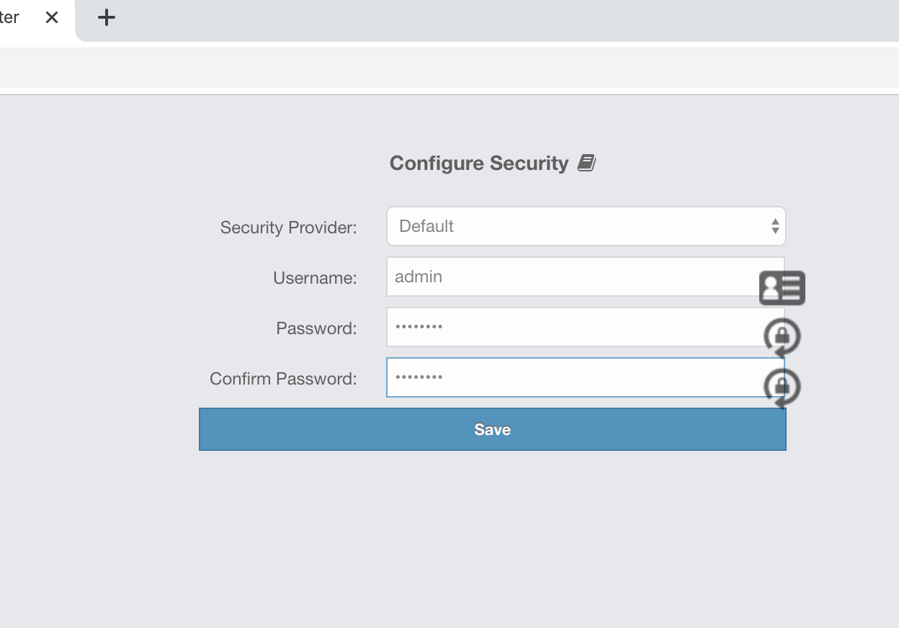
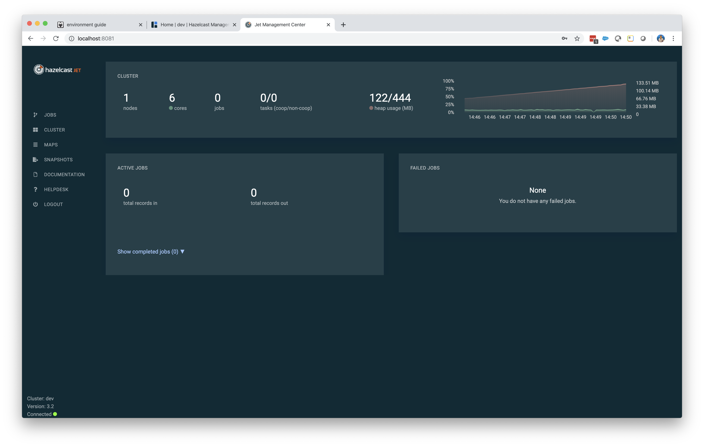

# Lab Environment Guide

The lab environment uses Docker and specifically the "docker-compose" command.  The main configuration file for docker-compose is `
docker-compose.yml`. Go ahead and have a look at it.  

To get help at any time with docker-compose, type:


```
docker-compose --help
```


## Environment Quick Reference

**Useful Commands**

start the environment: `docker-compose up -d`

view logs: `docker-compose logs --follow`

view only the logs of jet-server-1: `docker-compose logs --follow jet-server-1`

log on to a running container:  `docker-compose exec jet-server-1 bash`


**URLS**

Hazelcast Management Center: `http://localhost:8080/hazelcast-mancenter` 

Jet Management Center: `http://localhost:8081`  user name:  "admin" password:  "admin"


**Shared Drives**

Jet servers all have full access to files in the project at: `/opt/project`


## Lab: Environment Walk Through

1. Create a file named `.env` to the project directory.  *Note that the file name being with a dot.*  Add your Jet license key  following the example below.  Note how the name of the variable in the file is the same as the variable reference in `docker-compose.yml`.

   ```properties
   JET_LICENSE_KEY=YOUR LICENSE KEY
   ```

2. Initially, the environment consists of one Jet node, the Hazelcast IMDG Management Center and the Jet Management Center.  Bring them all up with the `docker-compose up` command as shown below.

   ```bash
   $ docker-compose up -d
   Creating jet-management-center  ... done
   Creating jet-server-1           ... done
   Creating imdg-management-center ... done
   
   ```

3. View the logs ...

   ```bash
   $ docker-compose logs --follow
   # press ctrl-c to stop viewing logs
   ```

4. View the Hazelcast Management Center.  In a browser, open the url: http://localhost:8080/hazelcast-mancenter. The first time you access management center, you will set the administrative user name and password. 

   

   Take a few minutes to explore the management center.

5. View the Jet Management Center.  In a browser, open the url: http://localhost:8081/. Log in with username "admin" and password "admin".  It should look like the image below.  We will use the Jet management center later on.

   

6. It is also possible to log on to a running container.  Note that the jet server(s) have the whole project mounted as  a shared drive : `/opt/project` . This means it is possible to read project files from within the containers.  For example, `docker-compose.yml` references a configuration file: `/opt/project/config/hazelcast.xml`, which may also be referenced locally, with your IDE, as `config/hazelcast.xml`.

   ```bash
   $ docker-compose exec jet-server-1 bash
   bash-4.4# ls /opt/project
   README.MD           config              doc                 docker-images       hazelcast-server    pom.xml
   UI                  data                docker-compose.yml  hazelcast-client    mc-home
   bash-4.4# exit
   ```

   

7. You can shut your environment down with the following command:

   ```bash
   $ docker-compose down
   ```

   


The commands you will use most frequently are listed below:

```
docker-compose up -d   
```

Starts all members of the distributed system as defined in `docker-compose.yml`.  Services that are already started will be left alone while services that are x


To run a single, ad-hoc container, use the docker-compose "run" command. For example to create a new container with the Jet software and log on to it interactively, use the following commands:

```
docker-compose run jet-server sh
```

In the command above, "jet-server" is the service name, as defined in `docker-compose.yml`.  In the container you just started, verify that java is already installed and on the class path.  Also note that Hazelcast Jet has been installed in the `/opt` directory. Also note that the whole project directory has been mounted under `/opt/project`.   For example, the `/opt/project/hazelcast-config` directory contains configuration files which are visible to all containers.

```bash
/opt/hazelcast-jet # java -version
openjdk version "1.8.0_201"
OpenJDK Runtime Environment (IcedTea 3.11.0) (Alpine 8.201.08-r1)
OpenJDK 64-Bit Server VM (build 25.201-b08, mixed mode)

/opt/hazelcast-jet # ls /opt
hazelcast-jet  project

/opt/hazelcast-jet # ls /opt/project
00_lab_environment_walkthru.md  UI                              docker-compose.yml              hazelcast-client                hazelcast-server
README.MD                       data                            docker-images                   hazelcast-config                pom.xml

/opt/hazelcast-jet # ls /opt/project/hazelcast-config/
hazelcast-client.xml  hazelcast-jet.xml     hazelcast.xml

/opt/hazelcast-jet # exit
```

Note that typing exit will stop the container.  Later we will see how to keep it running.

