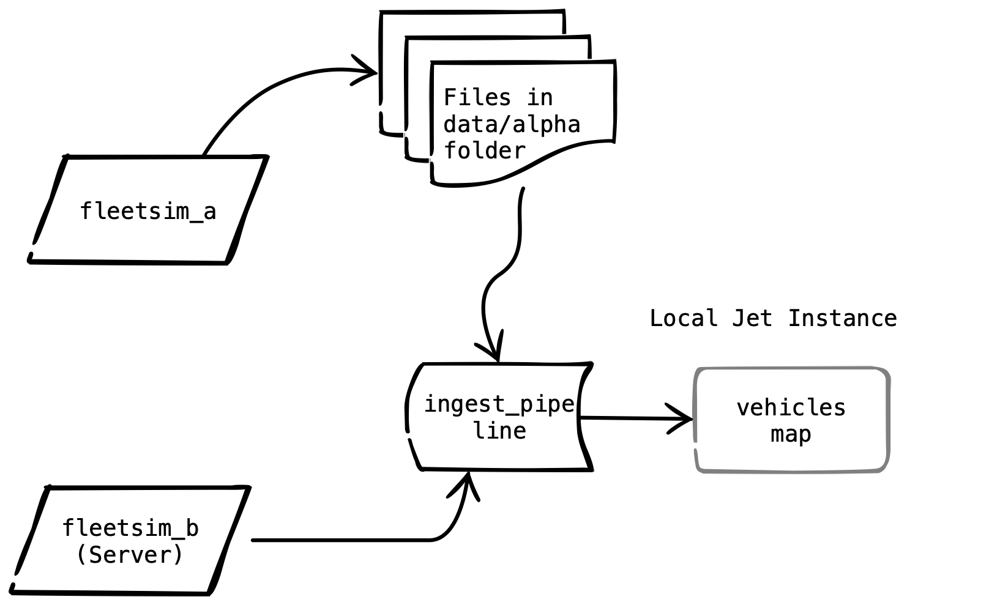
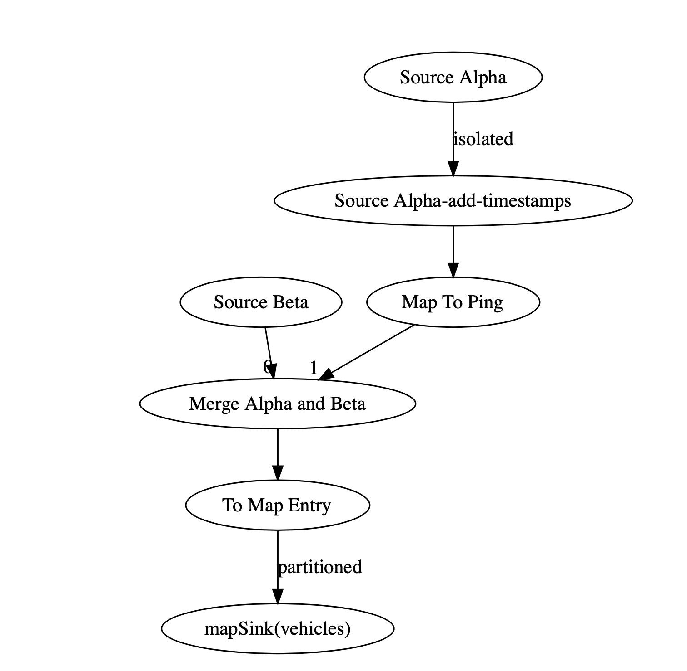

# Overview

Until now we have only configured, started and stopped Jet.  In this lab we are finally going to do something useful with Jet.

Our GPS data comes from 2 data sources, the "Alpha" data source consists of CSV formatted files and the "Beta" data source is a JSON formatted web service which must be polled.  We will ingest GPS pings from both, transform them into a standard format (HazelcastJsonValue) and put them in a Hazlecast map.

# About Source Alpha

GPS pings are appended to files in the `/opt/project/data/alpha` directory.  The name of the file is the vehicle VIN with a `.csv` suffix.  The fields are: vin, latitude, longitude, time.  The time field is expressed as seconds since a fixed point in time.  An example from one file is shown below:

```csv
1B3AS56C649JGV72N,40.98444444444444,-87.21777777777778,1575313565.115486
1B3AS56C649JGV72N,40.97885492479379,-87.20985686559924,1575313595.115486
1B3AS56C649JGV72N,40.97326540514313,-87.20193595342069,1575313625.115486
1B3AS56C649JGV72N,40.967675885492476,-87.19401504124214,1575313655.115486
1B3AS56C649JGV72N,40.96208636584182,-87.18609412906359,1575313685.115486
```

 

# About Data Source Beta

The Beta data source is a web service.  To pull a batch of pings, use an HTTP get like the following: `http://fleetsim_beta:8000/pings?since=123&limit=100

In the URL above, the "since" argument is used to retrieve only pings that have not already been processed.  Every ping has a unique sequence number.  The caller should keep track of the highest sequence number seen so far. On each subsequent that number should be passed as the "since" parameter.  The web service will return only pings with a higher sequence number.

The "limit" argument is not required but if provided, limits the maximum number of responses.  

The response is JSON formatted.  An example is shown below:

```JSON
[ { "vin": "1GAHG89G72LV6BHT9", "latitude": 35.22833333333333, "longitude": -80.84277777777777, "time": 1575381330.749117, "sequence": 27 }, { "vin": "JN1CA31DXYMVPYYZZ", "latitude": 41.035, "longitude": -83.64805555555556, "time": 1575381322.5402546 , "sequence": 28}, { "vin": "1G1ZU67866ZKWY0HX", "latitude": 33.730000000000004, "longitude": -84.38611111111112, "time": 1575381319.0953646 , "sequence": 29}, { "vin": "2D4CN5DG9B4GVNWVY", "latitude": 35.030277777777776, "longitude": -85.3125, "time": 1575381320.5347319, "sequence": 30 }, { "vin": "3FTZX08211BVJKTLU", "latitude": 39.361666666666665, "longitude": -85.37305555555555, "time": 1575381332.5957212, "sequence": 31 }, { "vin": "1GTSCTE04AZKXE5UJ", "latitude": 38.349444444444444, "longitude": -81.64, "time": 1575381331.4384263, "sequence": 32 }]
```

# Design

The diagram below depicts how the system should look when you are done.




The pipeline you will develop consists of the following components.

- A FileWatcher data source to read lines from data source Alpha.
- A mapping step to transform the lines from source Alpha into "Ping" objects.
- A custom data source to read GPS pings from the web service and assign timestamps.
- A merge step to combine the Pings from Alpha and the Pings from Beta
- A mapping step to turn the Pings into `Tuple2<String,HazelcastJsonValue>`
- An IMap sink to put the ingested data into a map.

The complete pipeline is depicted below:




# Instructions

1. Review the main class, "GPSIngestPipeline.java". Note that when  the "JET_MODE" environment variable is set to "LOCAL" a single node Jet instance will be started.  We will run in local mode.  Also note that a map listener has been attached to the "vehicles" map to facilitate testing.  The pipeline building code will go in the "buildPipeline" method.  In the next lab we will see how to deploy this to a running Jet cluster.

2. Write the custom data source.

   Review the documentation on [SourceBuilder](https://docs.hazelcast.org/docs/jet/3.2/manual/#source-sink-builder).  You will need to write a custom data source that emits time stamped `Ping` objects.  It does not need to be distributed but it should support snapshot and restore (we will use this later).  A starter has been provided: `BetaStreamSource`.

3. Build the initial pipeline for Beta.

   - In "buildPipeline", use the "SourceBuilder" API to build a custom data source.  You will have to wire up functions for creating the "BetaStreamSource",  pulling a batch of pings, saving the state and restoring the state.  Hint: the state is just the highest sequence seen so far.
   - Start the pipeline with an instance of your custom data source that returns timestamped "Ping" objects.  
   - Add a mapping step that converts a Ping object into a `Tuple2<String,HazelcastJsonValue>`.  We do this because Tuple2 implements Map.Entry and so can be put directly into a map.  The String part of the Tuple2 should be the vehicle's VIN, which will act as the map key.  "HazelcastJsonValue" is just a wrapper around a JSON formatted string.  We will us the GSON library to obtain a JSON string from a Ping object.  The code should look like this `Tuple2.tuple2(ping.getVin(), new HazelcastJsonValue(gson.toJson(ping)))`. _However you should not create a new  "Gson" instance for each and every ping._  That would be wasteful to say the least.  Instead, use "mapUsingContext" with the context being an instance of "Gson". 
   - Finish the pipleline by draining to the "vehicles" IMap.

4. Test what you've done so far.

   Start the data sources by copying "lab03.ym" to "docker-compose.yml" and running `docker-compose up -d`.  Now you can start and test your  pipeline within the IDE.  Make sure to attend to the following details.

   - To the VM options, add `-Dhazelcast.enterprise.license.key=YOUR LICENSE`
   - For program arguments , pass "data/alpha http://localhost:8000/pings".
   - Set JET_MODE=LOCAL in your environment.

   If all goes well you should see something like this:

   ```
   INFO: PUT 1GJGG25R0WDDHSF99 : {"vin":"1GJGG25R0WDDHSF99","latitude":35.391388,"longitude":-90.27194,"time":1.57547315E9, "sequence": 22}
   Dec 04, 2019 10:26:39 AM com.hazelcast.training.streams.ingest.DebugMapListener
   INFO: PUT 2C8GT54L53P3BH4PF : {"vin":"2C8GT54L53P3BH4PF","latitude":37.290573,"longitude":-89.785965,"time":1.57547315E9, "sequence" : 23}
   ...
   ```

5. Create a second source using FileWatcher.  The name of the directory to watch is passed as an argument to " buildPipeline".   Attach time stamps to the source by calling "withTimestamps" and passing a function to extract the timestamp from the line text returned by the FileWatcher.  Hint:  the "Util" class has some useful methods!

6. Transform the lines of text from Alpha into Pings using a map step.  Again, check out the "Util" class.

7. Merge the Pings from Alpha and the Pings from Beta

8. Rewire the mapping from Step 3 above to use the merged stream as an input.  Note that by merging the streams, we can reuse all subsequent processing.


You can now retest.  The output should look the same as before but some of the Pings should have 0 in the sequence number.  These pings come from the Alpha data source which does not use the sequence number field.  An example is shown below.

```
INFO: PUT 1GC2CYEL5BSEEB2ZU : {"vin":"1GC2CYEL5BSEEB2ZU","latitude":41.035,"longitude":-83.648056,"time":1.57550886E9,"sequence":0}
Dec 04, 2019 8:20:52 PM com.hazelcast.training.streams.ingest.DebugMapListener
INFO: PUT 1D3HE42N06EC01E2S : {"vin":"1D3HE42N06EC01E2S","latitude":41.660606,"longitude":-83.55994,"time":1.57550886E9,"sequence":150}
Dec 04, 2019 8:20:53 PM com.hazelcast.training.streams.ingest.DebugMapListener
INFO: PUT 1GC2CYEL5BSEEB2ZU : {"vin":"1GC2CYEL5BSEEB2ZU","latitude":41.035,"longitude":-83.648056,"time":1.57550886E9,"sequence":0}
Dec 04, 2019 8:21:01 PM com.hazelcast.training.streams.ingest.DebugMapListener
INFO: PUT 1GTHC99638D6MRLE1 : {"vin":"1GTHC99638D6MRLE1","latitude":35.25407,"longitude":-81.80654,"time":1.57550886E9,"sequence":151}
Dec 04, 2019 8:21:07 PM com.hazelcast.training.streams.ingest.DebugMapListener
INFO: PUT 1J4HA5D10BS840PD8 : {"vin":"1J4HA5D10BS840PD8","latitude":34.90071,"longitude":-81.61756,"time":1.57550886E9,"sequence":0}
Dec 04, 2019 8:21:22 PM com.hazelcast.training.streams.ingest.DebugMapListener
INFO: PUT 1D3HE42N06EC01E2S : {"vin":"1D3HE42N06EC01E2S","latitude":41.66745,"longitude":-83.554504,"time":1.57550886E9,"sequence":152}
Dec 04, 2019 8:21:23 PM com.hazelcast.training.streams.ingest.DebugMapListener
INFO: PUT 1GC2CYEL5BSEEB2ZU : {"vin":"1GC2CYEL5BSEEB2ZU","latitude":41.043518,"longitude":-83.64778,"time":1.57550886E9,"sequence":0}

```


