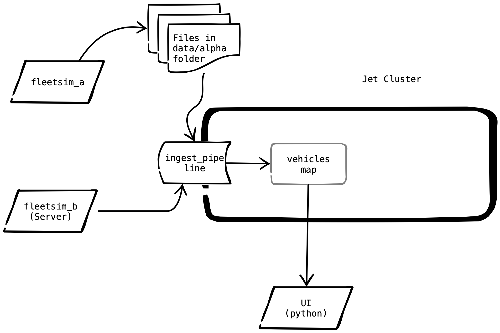

# Overview

Until now we have only configured, started and stopped Jet.  In this lab we are finally going to do something useful with Jet.

We have 2 sources of fleet data, "Alpha" and "Beta".  Both sources have the same logical content but they differ by format and also delivery mechanism.  "Alpha" consists of CSV files in a shared directory that we must watch.  The other source, "Beta",  is a JSON formatted web service that must be polled. The first can be read with an out of the box source but the second will require a custom source.  

Both streams will have the same IMap, named "positions" as their sink.  

> Tip: while the original sources cannot be checkpointed or replayed, the IMap supports both.  Later, when we develop additional streams we will use the IMap as a source.  This is one way to take an external source which you have no control over, and make it effectively support checkpoint and restart !


# About Source Alpha

GPS pings are appended to files in the `/opt/project/data/alpha` directory.  The name of the file is the vehicle VIN with a `.csv` suffix.  The fields are: vin, latitude, longitude, time.  The time field is expressed as seconds since a fixed point in time.  An example from one file is shown below:

```csv
1B3AS56C649JGV72N,40.98444444444444,-87.21777777777778,1575313565.115486
1B3AS56C649JGV72N,40.97885492479379,-87.20985686559924,1575313595.115486
1B3AS56C649JGV72N,40.97326540514313,-87.20193595342069,1575313625.115486
1B3AS56C649JGV72N,40.967675885492476,-87.19401504124214,1575313655.115486
1B3AS56C649JGV72N,40.96208636584182,-87.18609412906359,1575313685.115486
```

# About Source Beta

The Beta source is a pull, not a push.  To pull a batch of pings, use an HTTP get like the following: `http://fleetsim_beta:8000/pings?since=12345.678&limit=100

In the URL above, the "since" argument is used to retrieve only pings that have not already been processed.  It is the caller's responsibility to keep track of the highest timestamp seen so far.  Each subsequent call to the URL should pass the highest timestamp seen so far.

The "limit" argument limit the maximum number of responses.  This limit is applied _per vehicle_ so, if there are 250 vehicles and you pass a limit of 1 you will get back as many as 250 pings, one from each vehicle.

The response is JSON formatted.  An example is shown below:

```JSON
[ { "vin": "1GAHG89G72LV6BHT9", "latitude": 35.22833333333333, "longitude": -80.84277777777777, "time": 1575381330.749117 }, { "vin": "JN1CA31DXYMVPYYZZ", "latitude": 41.035, "longitude": -83.64805555555556, "time": 1575381322.5402546 }, { "vin": "1G1ZU67866ZKWY0HX", "latitude": 33.730000000000004, "longitude": -84.38611111111112, "time": 1575381319.0953646 }, { "vin": "2D4CN5DG9B4GVNWVY", "latitude": 35.030277777777776, "longitude": -85.3125, "time": 1575381320.5347319 }, { "vin": "3FTZX08211BVJKTLU", "latitude": 39.361666666666665, "longitude": -85.37305555555555, "time": 1575381332.5957212 }, { "vin": "1GTSCTE04AZKXE5UJ", "latitude": 38.349444444444444, "longitude": -81.64, "time": 1575381331.4384263 }]
```

# Design

The diagram below depicts how the system should look when you are done.



The lab consists of implementing the ingest Jet pipeline, which should have the following components:

1. An event journal configuration for the "vehicles" map in `config/hazelcast.xml`
2. A FileWatcher source to watch the contents of the `data/alpha` folder and assign timestamps and keys.
3. A mapping step (could be one or more) to transform each line from the CSV files into HazelcastJSONValue objects.  The JSON should match the format of the individual pings in the beta source.
4. A custom source to pull data from the web service and assign timestamps and keys.  Remember the source must keep track of the highest timestamp it has seen so it can pull only new data.
5. A merge step to combine the two streams.
6. A sink to put the items into the "vehicles" map.  The key should be the vehicle VIN and the value should be a HazelcastJSONValue.

# Verification

Once everything is working you should be able to see the vehicles on the UI.  