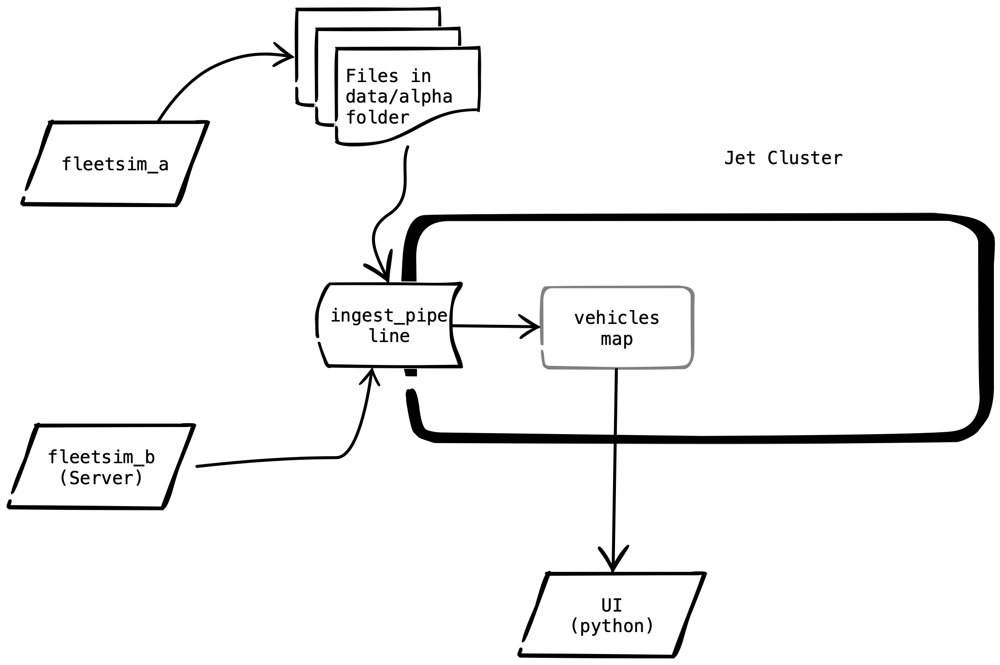
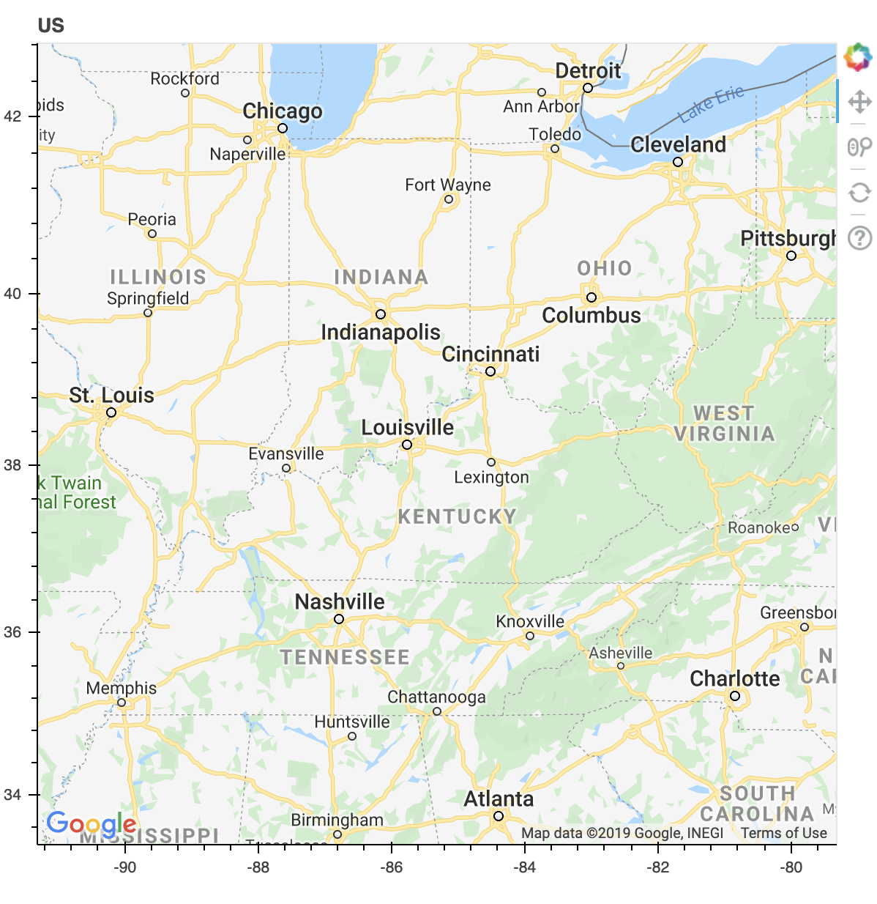
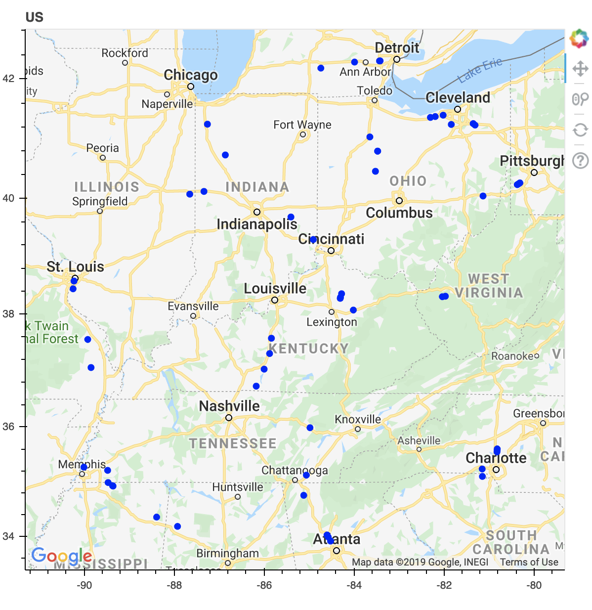
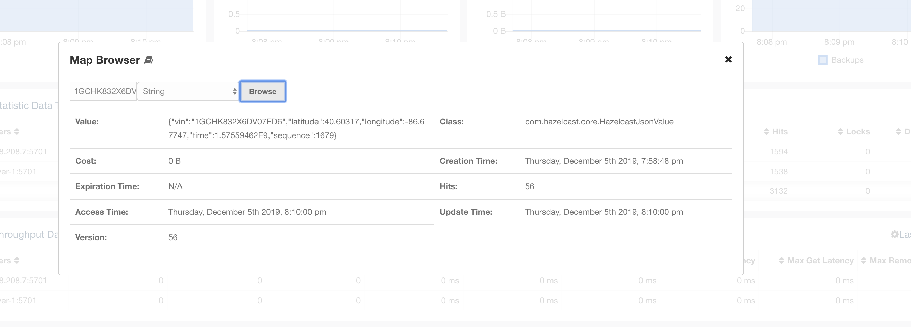

# Overview

Up until now we have operated in development mode, with only a single Jet instance which is colocated with the code that builds the pipeline.  In this lab we will see how to package a job and deploy it to a pre-existing Jet cluster.   We'll also see how to update a job without missing any events.

We will not add any pipeline stages in this lab. We will just be separating the Jet cluster from the Jet job definition.  We will also introduce a UI that will allow us to visualize the GPS pings.

The resulting system will look like this:




Throughout this lab you will want to make frequent reference to [section 3](https://docs.hazelcast.org/docs/jet/3.2/manual/#work-with-jet) of the Jet Reference Manual.

# Part 1 - Package and Deploy a Jet Job

In this  part, we will bring up a 2 node Jet cluster as well as all of the other parts of the system and then we will deploy our job to the Jet cluster using the `jet.sh` script.


1. First, lets configure the job for fault tolerance. You need to create a "JobConfig" instance and set the processing guarantee and the snapshot frequency.  See the sample code below.

   ```java
   ...
   JobConfig config = new JobConfig();
   config.setProcessingGuarantee(ProcessingGuarantee.AT_LEAST_ONCE);
   config.setSnapshotIntervalMillis(10 * 1000);
   
   String dir = args[0];
   String url = args[1];
   Pipeline pipeline = buildPipeline(dir, url);
   jet.newJob(pipeline, config);
   
   ```

   

2. Now package the job for deployment.  This is mostly done.

   - Review `ingest-pipeling/pom.xml`. Note the following:
     - The shade plugin has been used to package all of the dependencies (e.g. gson) into a single jar.
     - A manifest entry has been added to indicate the main class.
   - Change the scope of the "hazelcast-jet-enterprise" dependency to "provided".  There is no need to package these into the job because it will be running on a Jet node that already the Jet classes.
   - Package the jar.

   ```bash
   $ cd ingest-pipeline
   $ mvn package
   ```

   

3. Start the environment.

   Copy `lab04.yml` to `docker-compose.yml` and start the environment with `docker-compose up -d`.

   This will start the following things:

   - A 2 node Jet cluster
   - IMDG Management Center at http://localhost:8080/hazelcast-mancenter
   - Jet Management Center at http://localhost:8081
   - The "fleetsim-alpha" data generator which writes CSV records to `/opt/project/data/alpha`
   - The "fleetsim-beta" web service at http://localhost:8000/pings
   - The UI, which can be accessed at http://localhost:5006/dashboard

   Take a minute to verify everything is working.  

   Currently, the UI should look like the one below, showing a map of the central US region with no icons on it.

   

4. Now deploy the job.

   Run at extra copy of the jet container and log in to a shell.

   ```bash
   $ docker-compose run jet-server-1 bash 
   # within the container now 
   
   $ jet.sh -f /opt/project/config/hazelcast-client.xml -v submit /opt/project/ingest-pipeline/target/ingest-pipeline-1.0-SNAPSHOT.jar /opt/project/data/alpha http://fleetsim-beta:8000/pings
   ```

   If all goes well, you should start to see entries in the "vehicles" map within IMDG management center and Jet management center.  Also, each ping should now be depicted on the UI (if you watch long enough you should be able to see the vehicles moving).

   

As a bonus, pick a VIN from the data and display the corresponding map entry using the "Map Browser" feature of IMDG management center.



