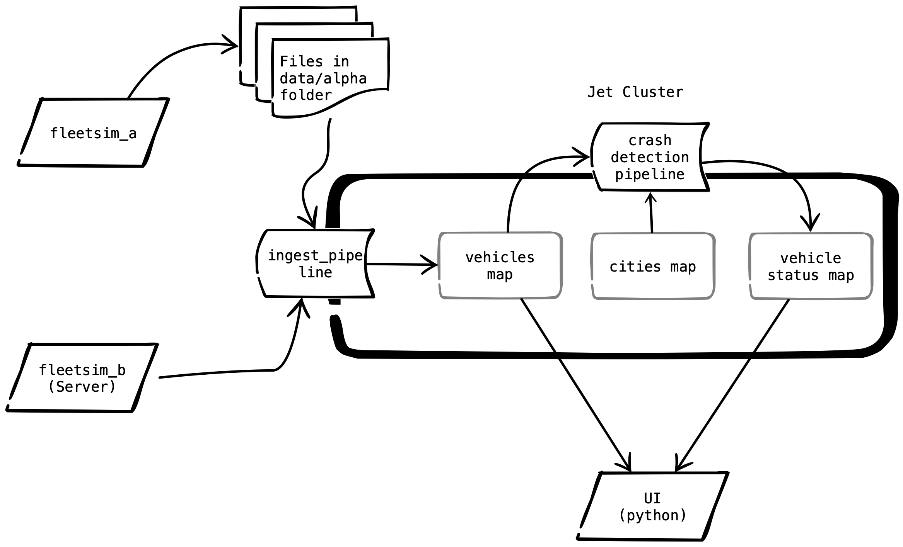

# Overview

In this lab we will begin to act on the data.  We will also see how Jet and IMDG together form a powerful combination.   

The engine code 'B0001' indicates that the driver airbag has deployed and is a strong indicator that a crash has occurred.  We will make a new pipeline that listens for changes from the "vehicles" map (i.e. the same map that is loaded by the ingest pipeline).  The pipeline should then filter for pings with a 'B0001' engine code.  When a crashed vehicle is found, an aggregator can be run against the "cities" map to determine the closest city.  The original vehicles map will then be updated with a "status" and "note". done, the lab will look like the diagram below.

 

