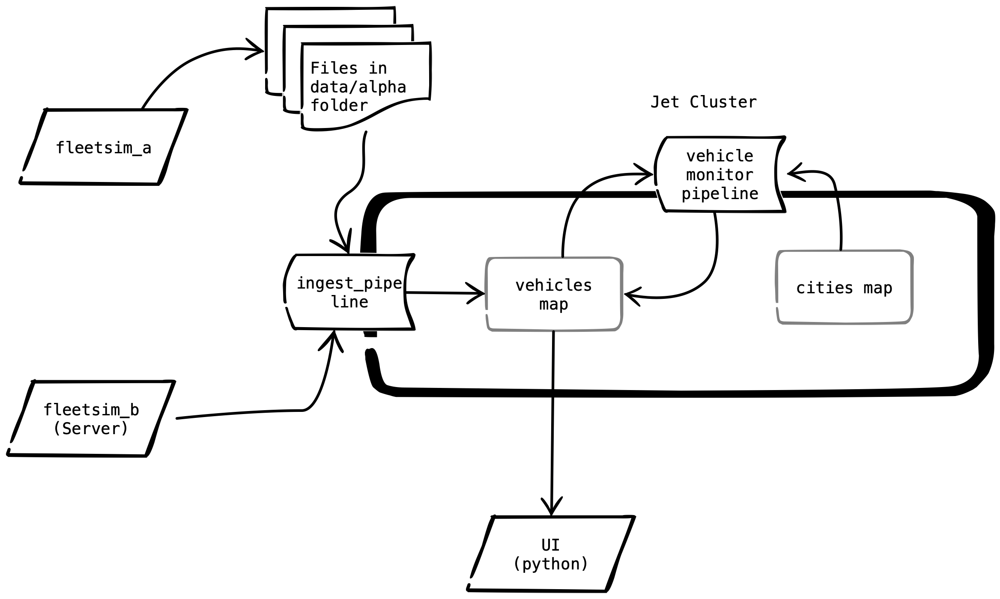

# Overview

In this lab we will begin to act on the data.  We will also see how Jet and IMDG together form a powerful combination.   

The engine code 'B0001' indicates that the driver airbag has deployed and is a strong indicator that a crash has occurred.  We will make a new pipeline that listens for changes from the "vehicles" map (i.e. the same map that is loaded by the ingest pipeline).  The pipeline should then filter for pings with a 'B0001' engine code.  When a crashed vehicle is found, we will use an [aggregator](https://docs.hazelcast.org/docs/3.12.5/manual/html-single/index.html#fast-aggregations) to scan all cities in parallel and identify which is the closest.  In real life, the system would automatically dispatch help from the closest city.  In this lab, we will just log the fact that a crash has been detected along with the closest city.  We will also update the "status" field of the entry in the "vehicles" map so that the crash will be displayed in red on our dashboard.


When we are finished our system will look like the diagram below.





**A Note About Concurrent Updates**

We now have 2 jobs updating vehicles in the vehicles map.  The default behavior of the Hazelcast map sinks is to simply do a "put" on the entry.  The vehicle monitor pipeline updates the vehicle status field and the ingest pipeline updates all of the other fields.  Neither reads the entry before updating it so there is potential for the vehicle monitor pipeline to overwrite the location fields and for the ingest pipeline to overwrite the status fields. We must modify both jobs to prevent this.

There are several ways to handle this with Jet. See the [Jet Reference Manual](https://docs.hazelcast.org/docs/jet/3.2/manual/#update-entries-in-imap). In this lab the suggested approach is to use `Sinks.mapWithUpdating`.

> Unfortunately, EntryProcessors and Aggregators invoked from a Jet job currently are not picked up via Jet's code deployment mechanism.  This includes `Sinks.mapWithUpdating` and `Sinks.mapWithMerging` which use entry processors internally.  For pipelines that use these features, the code must be put on the server class path.  Updating these pipelines requires a rolling restart of the Jet nodes.  We have seen that this does not cause event processing to stop as Jet will automatically restart affected jobs from the last check point.

Expected Time: 1 hour 20 minutes

# Instructions

Starting with this lab, the instructions will contain less detail. Although one approach is suggested, feel free to solve the business problem using any of the tools in your tool kit.

To complete this lab you need to complete the following high level steps.

1. Update the ingest pipeline to use the "mapWithUpdating" sink so that the ingest pipeline will not overwrite changes made by the new vehicle monitor pipeline.
2. Complete the vehicle monitor pipeline.  It should have the following elements.
   - A "mapJournal" source attached to the "vehicles" map.
   - A stateful filter, which looks for Pings that have "B0001" in their "obd_codes" list. _Note that it's possible for the map entry of a vehicle that has already crashed to be updated.  For example the timestamp field could be updated.  Use a stateful filter to avoid creating new crash events for vehicles that have already crashed._
   - A "mapWithContext" step that uses an aggregator you have written to find the name of the city that is closest to the crash.  The context should be the "cities" map.  The output of this step should be a tuple containing the VIN of the crashed vehicle and the name of the closest city.
   - One sink to log the crash.
   - One sink that uses "mapWithUpdating" to update the status of the vehicle to "CRASHED".

A schematic of the new pipeline is shown below:


To verify, deploy the original ingest pipeline, then deploy the new vehicle-monitor-pipeline.  Once the vehicle monitor pipeline is deployed, you should begin seeing output from the logging sink that looks similar to that shown below.

```
jet-server-2              | 14:52:50.565 [hz._hzInstance_1_dev.jet.blocking.thread-2] INFO  com.hazelcast.jet.impl.connector.WriteLoggerP.Dispatch Help#1 - [192.168.240.9]:5701 [dev] [3.2] CRASH DETECTED: 2G1WF55K739315431 HELP DISPATCHED FROM: Nashville

```


Also, you should begin to see red dots appear on your map.  


 

