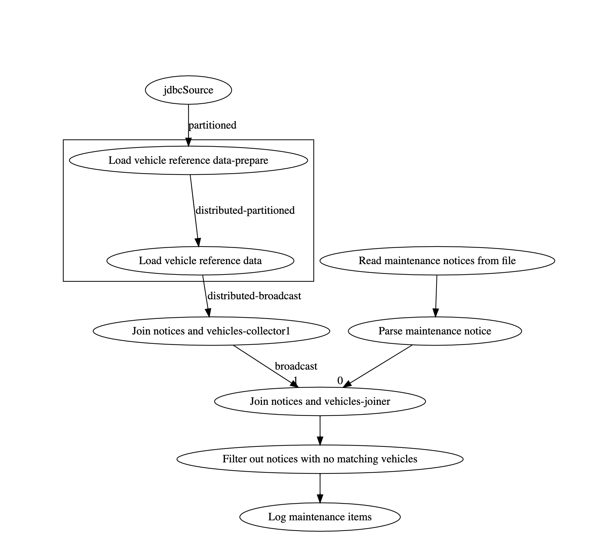

# Overview

In this lab we will be using Jet to deliver maintenance notifications.  Along the way we will see how Jet can effectively join data from different sources.  In this case, maintenance notices in a file will be joined with vehicle reference data in a database.

Expected Time: 1 hour

# Specifications

Write an on demand job to send maintenance notifications.  This job should scan the contents of the maintenance notice file , join it with the VIN database and produce a maintenance notice (for this lab, just log a message) for each impacted vehicle in the fleet. 

Note that unlike the other jobs that process an infinite stream of messages and do not end, this job does end.  Modify the main program to wait for the job to exit as shown below.

```java
				...
        Pipeline pipeline = buildPipeline();
        jet.newJob(pipeline, config).join();  // join will wait for the job to finish
```


Maintenance notices will be written to the file: `/opt/project/data/maintenance/jet-server-1/notices.txt`. The file will be CSV formatted.  An example is shown below.

```
Notice Num,Year, Make, Model,Note 
1, 2002, Dodge, Durango, Inspect wheel bearings for premature wear.
2, 2014, Honda, Civic, Emissions issue.
```


The map between year/make/model and VIN is in a database table.  The connection information is as follows:

- Driver: org.hsqldb.jdbc.JDBCDriver
- URL: jdbc:hsqldb:hsql://localhost/umove
- User: "SA"
- Password: ""

To inspect the data, you can use any SQL client. The hsqldb sql client tool is included with the lab materials and can be run with the `sqltool.sh` script. 

The image below show the table layout and a sample of the data.


This situation is ideal for a hash join, be sure to read the [Jet reference manual](https://docs.hazelcast.org/docs/jet/3.2.1/manual/#hash-join) on this topic.

When you run the job, you should see log messages similar to the ones shown below.

```
jet-server-1              | 19:24:35.501 [hz._hzInstance_1_dev.jet.blocking.thread-6] INFO  com.hazelcast.jet.impl.connector.WriteLoggerP.Log maintenance items#0 - [jet-server-1]:5701 [dev] [3.2] MAINTENANCE NOTICE: 009 FOR 1C4AJWAG6FL540685 (2015|jeep|wrangler) -  Emissions issue.
jet-server-1              | 19:24:35.501 [hz._hzInstance_1_dev.jet.blocking.thread-6] INFO  com.hazelcast.jet.impl.connector.WriteLoggerP.Log maintenance items#0 - [jet-server-1]:5701 [dev] [3.2] MAINTENANCE NOTICE: 010 FOR 1C4RJFBG4FC632587 (2015|jeep|grand cherokee) -  Passenger airbag issue.
```


# Implementation Notes

- The hash join is like a left outer join.  It will produce at least one row of output for every input.  If a particular row of input has no matches, the right hand output item will be null.  You will want to filter these out.

- The HSQLDB JDBC driver must be added to the server class path.  It will not automatically deploy with the job.

  

# Instructions

In this lab you just need to build the pipeline.  Also, as always, don't forget to `cp lab06.yml docker-compose.yml`. Also, if it does not exist, create the `data/maintenance/jet-server-2` folder before beginning.

The diagram below shows the pipeline you need to build.  Some of the nodes in the diagram are created automatically by Jet.



1. Use `Sources.jdbc` to retrieve the vehicle make and model information from the database.
2. Use `Sources.file` to read the lines of the maintenance notice file.  Note that the source will run on every node.  The 2 jet members have been configured to user different directories so they will not both process all of the data.
3. Write a mapping step to parse the lines of the maintenance notice file so that individual elements can be accessed.
4. Use a hash join to join the output of step 1 and step 3.
5. Filter out result lines that do not have a matching vehicle.
6. Log the results.

