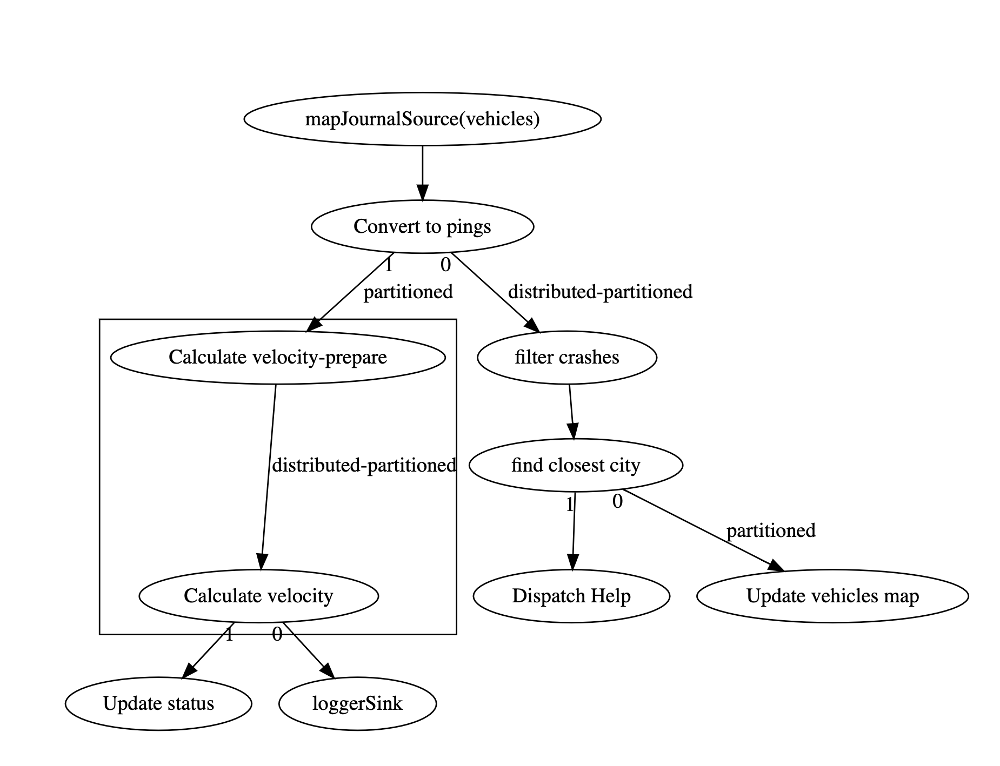

# Overview

In this lab we will be catching speeders!  To do this we will be enhancing the vehicle-monitoring-pipeline we built previously.  We will be using a custom aggregator to calculate speed based on a series of Pings.

It may not seem immediately obvious how speed can be considered an aggregation because we are more familiar with aggregations like "sum" or "average".  Hazelcast Jet supports these calculations with built in aggregates but it also support any user defined calculation on a collection of events.  If we have a all of the GPS pings from the last minute for one vehicle then we can calculate the distance and time between the first and the last ping and thus the speed of the vehicle.  This is a use case for a custom aggregation.  

Before starting, be sure you are familiar with the sections of the Jet reference manual pertaining to [the aggregation apis](https://docs.hazelcast.org/docs/jet/3.2.1/manual/#windowed-aggregation), [window definitions](https://docs.hazelcast.org/docs/jet/3.2.1/manual/#kinds-of-windows) and the [custom aggregation api](https://docs.hazelcast.org/docs/jet/3.2.1/manual/#implement-your-aggregate-operation).  

Jet will be producing a speed value for each vehicle every 15 seconds.  However, the speeding status of a vehicle will probably not change every 15 seconds.  In other words, most of the time, non-speeders will continue not to speed and speeders will continue to speed.  The dashboard has a listener on the "vehicles" map so that it can update the UI when things change.  It would be preferable not to update the entry when there is no change to status.  An entry processor can be used to accomplish this.  See `Sinks.mapWithEntryProcessor` for details.

Expected Time: 1 hour 40 minutes

# Instructions

The basic approach for this solution should be 

- Group the stream of pings by VIN
- Define a sliding window which will contain the last 4 minutes of pings.  The window should update once every 15 seconds.  
- Define a custom aggregator that will compute the speed of each vehicle
- Create an entry processor that will apply the update to the status field but only if the value has actually changed.
- Wire everything up and test. Speeders should show up in yellow.

The chart below shows the update pipeline. As with the other diagrams, note that some of these elements are generated by Jet internally.

