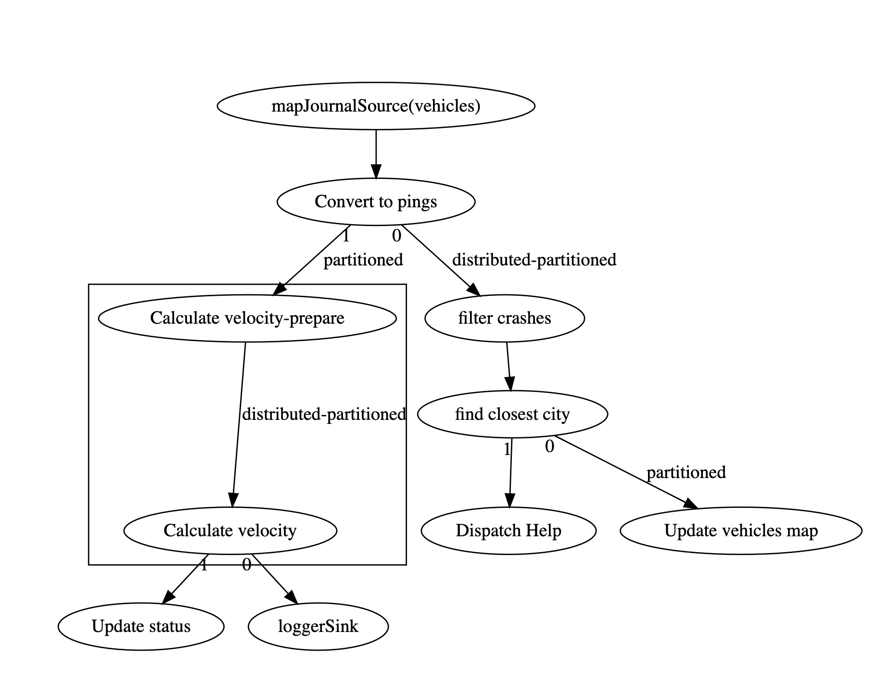

# Overview

The Jet philosophy is to pre-compute the results of a query.  Doing the work on the way in introduces a fixed overhead per event but retrieving the query results is a constant cost that does not depend on the amount of data involved.

However, this can only occur if the query is known ahead of time.  There are still cases where ad-hoc queries are appropriate.  This lab will explore IMDGs ad-hoc query capabilities.  

In this workshop we have chosen "HazelcastJsonValue" as the serialization format, primarily because it interoperates well with the python based UI. Another advantage of HazelcastJsonValue is that it can be queried easily.

Expected Time: 40 minutes

# Instructions

The basic approach for this solution should be 

- Group the stream of pings by VIN
- Define a sliding window which will contain the last 4 minutes of pings.  The window should update once every 15 seconds.  
- Define a custom aggregator that will compute the speed of each vehicle
- Create an entry processor that will apply the update to the status field but only if the value has actually changed.
- Wire everything up and test. Speeders should show up in yellow.

The chart below shows the update pipeline. As with the other diagrams, note that some of these elements are generated by Jet internally.

