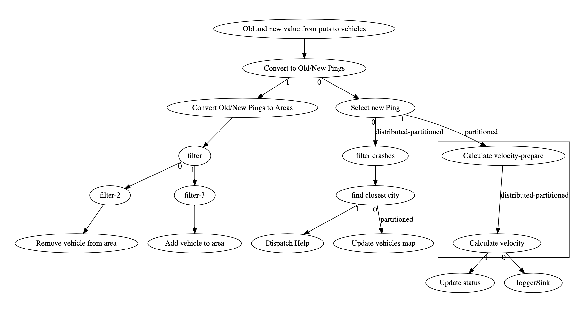

# Overview

UMove wants to keep track of vehicles that are in certain areas of interest.  In this lab, you will update the  vehicle monitoring job to do just that.

The areas of interest are defined in the areas map.  Areas are rectangular and are characterized by a name and a minimum and maximum latitude and a minimum and maximum longitude.  Areas also contain a list of VINs.  For this lab, you can assume that areas do not overlap so a vehicle is in at most one are at a time.  The job you write should keep that list updated. If the vehicle leaves one area and enters another, it is not necessary to update the 2 area entries transactionally.

Estimated Time: 1 hour 20 minutes

# Instructions

We only want to take action once when a vehicle moves into or out of an area.  A vehicle moving around within the same area should not produce any output.  In the past this sort of change detection has been handled by using an entry processor with to put only changes into a map. We can't use that technique here because the vehicle may leave one area and enter another.  This would involve manipulating 2 different map entries which is not something that can be done with an entry processor. Instead, we need to go all the way back to the source.

- Modify the event source to expose both the old and the new values.

  The source in this case is a map in IMDG, or more specifically, the event journal associated with a map.  The events in the event journal actually contain both the old and the new value.  By specifying a filter function and a projection function when the source is created, it is possible to expose the original journal event.  An example is shown below.		

```java
StreamStage<EventJournalMapEvent<String, HazelcastJsonValue>> oldNew =   pipeline.drawFrom(Sources.<EventJournalMapEvent<String, HazelcastJsonValue>, String, HazelcastJsonValue>mapJournal(
                "vehicles",
                item -> item.getType() == EntryEventType.ADDED || item.getType() ==              EntryEventType.UPDATED,
                item -> item, JournalInitialPosition.START_FROM_CURRENT))
                .withTimestamps(journalEvent -> extractTimestampFromPingEntry(journalEvent.getNewValue().toString()), MAXIMUM_LATENESS_MS).setName("Old and new value from puts to vehicles");

```


- Modify the stage that converts `HazelcastJsonValue` into `Pings`.  It will now need to convert both the old and the new value into Pings.
- Add a stage to select only the new value and connect the remainder of the existing pipeline to it so that everything down stream will continue to work.
- Add a `mapUsingContext` stage to convert the old and new Pings into old and new areas.  This stage should output a 3-tuple (vin, old area, new area).  Note that either or both of the areas can be null.  For example, if the vehicle is not in any area at all.
- In many cases, the event does not signify a change of area.  For example the vehicle may just stay in the same area or it may not be in any designated area.  Add a filter stage to pass only events that represent a change between old and new.
- From here the stream should fork with one branch dealing with vehicles entering an area by adding the vehicle to that areas list and the other branch should deal with vehicles that are leaving an area.  Remember that multiple streams may be trying to update the same area.  Use `Sinks.mapWithEntryProcessor` to handle updating the list in the area entries.

When you are done, your pipeline will look something like the diagram below.




# Verification

- You should see messages in the log when vehicles enter and leave an area.
- Using the Management Center, inspect some of the entries in the area map to verify that the vehicle list is populated.