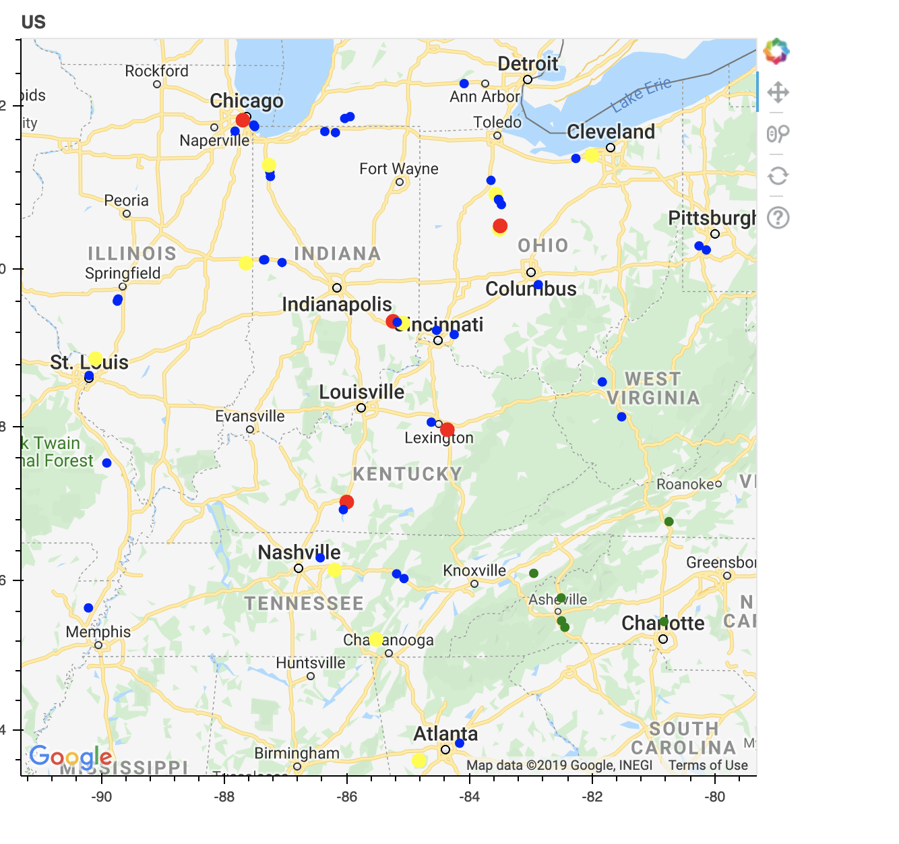

# Overview

The Jet philosophy is to pre-compute the results of a query.  Doing the work on the way in introduces a fixed overhead per event but the cost of executing a query increases with the amount of data.

However, this can only occur if the query is known ahead of time.  There are still cases where ad-hoc queries are appropriate.  This lab will explore IMDGs ad-hoc query capabilities.  

In this workshop we have chosen "HazelcastJsonValue" as the serialization format, primarily because it interoperates well with the python based UI. Another advantage of HazelcastJsonValue is that it can be queried easily.  We will see how in this lab.


Expected Time: 40 minutes

# Instructions

Complete the query client in the "query-client" project.

- The "query" command runs a user supplied query and prints the results to stdout
- The "select"  command should update the "status" field of the selected entries in "vehicles" to "SELECTED", while the "deselect" command should update the status to an empty String.  Be careful to do this in a way that does not overwrite the other fields of the entry.  One of the best ways to accomplish this is with an EntryProcessor.


Now run the query client from an ad-hoc container (`docker-compose start jet-server-1 bash`) and experiment with a few predicates.  Refer to [the documentation](https://docs.hazelcast.org/docs/latest/manual/html-single/index.html#querying-with-sql) for examples of syntax.

An example command and the resulting map is shown below.

```
query latitude between 35 and 37 and longitude between -84 and -80
	{"vin":"WVWMA63B7XE019902","latitude":36.77374,"longitude":-80.74501,"time":1.57748429E9,"sequence":0,"status":""}
	{"vin":"1FMJU1HT8FEF12156","latitude":35.501606,"longitude":-82.51752,"time":1.57748429E9,"sequence":0,"status":""}
	{"vin":"4USCH7330WLE14162","latitude":35.348057,"longitude":-82.42135,"time":1.57748429E9,"sequence":0,"status":""}
	{"vin":"2G1FT1EW2E9126788","latitude":36.094837,"longitude":-82.948746,"time":1.57748429E9,"sequence":0,"status":""}
	{"vin":"WDBRF52H46A840094","latitude":35.770638,"longitude":-82.50151,"time":1.57748429E9,"sequence":0,"status":""}
	{"vin":"5N1AL0MM4DC368142","latitude":35.499046,"longitude":-80.823456,"time":1.57748429E9,"sequence":0,"status":""}
```


```
select latitude between 35 and 37 and longitude between -84 and -80
```




