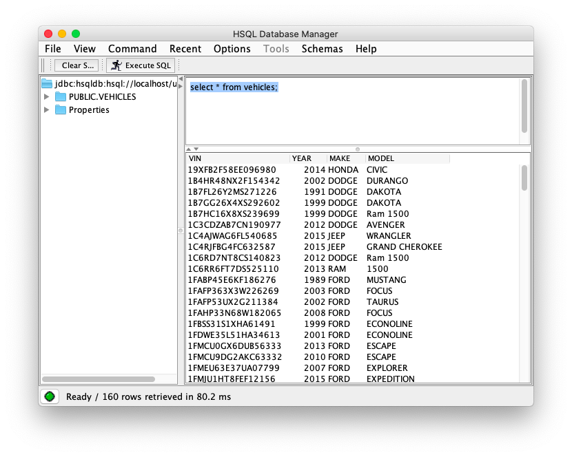

# Overview

In this lab, we will see how a stream of data can be combined with data from a wide variety of other sources.  In this case, the stream of GPS pings will be enhanced with information needed to support make/model based functionality and location based functionality.

The make and model will come from a static database table. We will extend the ingest pipeline using a hash join to add in the make and model. 

To support location based services, each ping needs to be classified into a grid square on the map.  We will see how "mapUsingContext" can be used to integrate virtually any custom logic into a pipeline.

When we are done, the system will look like the diagram below.

# Step 1: Start Up and Review the DB

As usual, before starting, stop the previous environment and clean up the files in `data/alpha` and `hot-restart`.  A script has been provided: `cleanup.sh`. Copy `lab05.yml` to `docker-compose.yml`.

Start the system: `docker-compose up -d`.

To begin with, familiarize yourself with the vehicles database.  Run `sqltool.sh` then connect to the database using the following JDBC connection information.

- Driver: org.hsqldb.jdbc.JDBCDriver
- URL: jdbc:hsqldb:hsql://localhost/umove
- User: "SA"
- Password: ""

Run `select * from vehicles;` to see the data.

# Step 2: Integrate Make/Model Information

​	